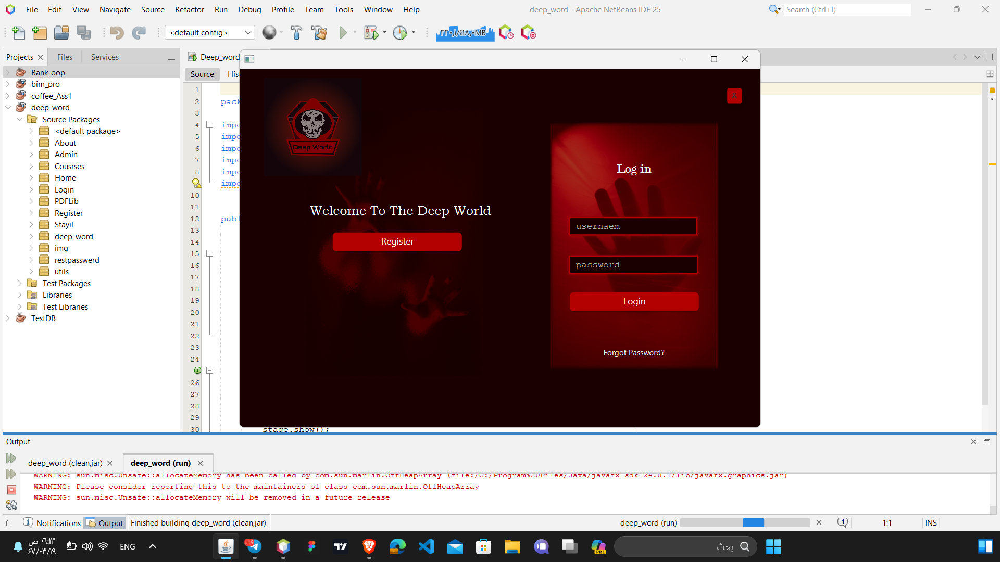
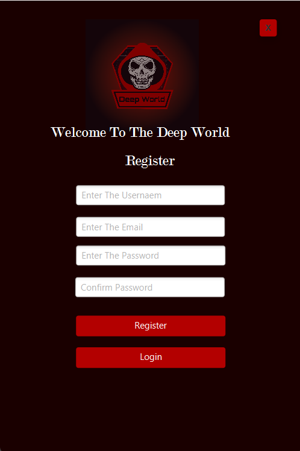
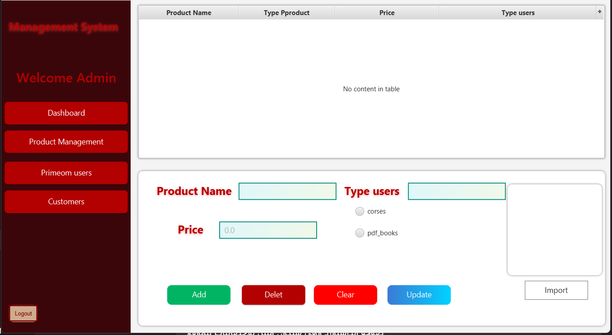
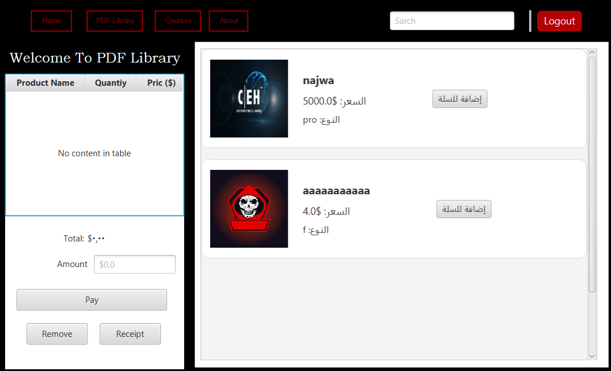
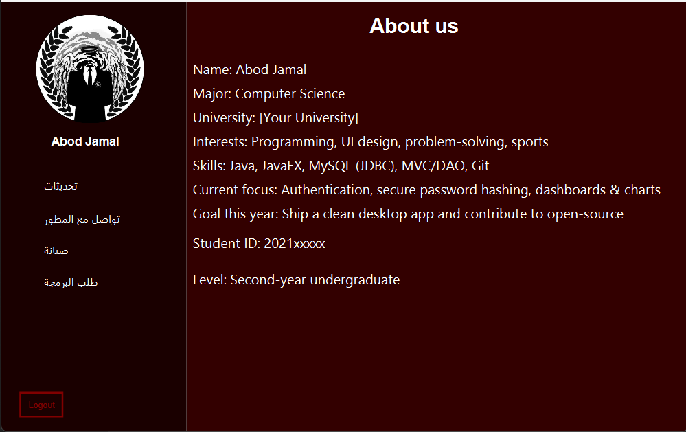

# 💀 Deep World - Advanced JavaFX Management System

[](https://www.oracle.com/java/)
[](https://openjfx.io/)
[](https://www.mysql.com/)
[](LICENSE)

**Deep World** is a comprehensive, high-fidelity Desktop Management System built with **JavaFX**. It features a modern, dark-themed UI (Red & Black) designed for high-performance administrative tasks, product management, and digital content distribution.

---

## 📸 Screenshots

### Authentication & Dashboard



### Management & Library



### About the Developer


---

## ✨ Key Features

- **🔐 Advanced Authentication:** Secure Login, Registration, and Password Reset systems with custom field validation.
- **📊 Admin Dashboard:** Centralized control panel for monitoring system statistics and user activities.
- **📦 Product Management:** Full CRUD operations (Add, Update, Delete, Search) for managing digital and physical products.
- **📚 PDF Library:** A dedicated module for browsing, searching, and managing digital documents/books with an integrated payment gateway UI.
- **🎨 Modern Dark UI:** Custom CSS-styled interface with a professional "Hacker" aesthetic, optimized for desktop users.
- **🗄️ Database Integration:** Robust data persistence using MySQL with optimized JDBC connections.

---

## 🛠 Tech Stack

- **Language:** Java (JDK 17+)
- **UI Framework:** JavaFX (FXML & Scene Builder)
- **Styling:** Custom CSS (Modern Dark/Red Theme)
- **Database:** MySQL (Relational Data Storage)
- **Architecture:** MVC (Model-View-Controller) / DAO Pattern
- **Build Tool:** Apache Ant (NetBeans Project Structure)

---

## 🚀 Getting Started

### Prerequisites
- Java Development Kit (JDK) 17 or higher.
- JavaFX SDK configured in your IDE.
- MySQL Server installed and running.

### Installation & Setup
1. **Clone the repository**:
   ```bash
   git clone https://github.com/abodjmal2004/Deep-World-Management-System.git
   cd Deep-World-Management-System
   ```
2. **Database Setup**:
   - Import the provided SQL schema (if available) or create a database named `TestDB`.
   - Update the connection strings in the source code with your MySQL credentials.
3. **Open in IDE**:
   - Import the project into **NetBeans**, **IntelliJ IDEA**, or **Eclipse**.
   - Ensure JavaFX libraries are added to the project's classpath.
4. **Run the application**:
   - Execute the `main` method in the entry class.

---

## 👨‍💻 Developer

**Abod Jamal** — Software Developer & Computer Science Student  
Passionate about building secure desktop applications, clean architectures, and modern UI/UX experiences. Based in Gaza, Palestine.

### 🌐 Connect With Me
[](https://t.me/xw_25aa)
[](https://instagram.com/xw_.0)
[](https://github.com/abodjmal2004)
[](https://www.linkedin.com/in/abod-jamal-dev/)

---

## 📄 License
This project is licensed under the MIT License - see the [LICENSE](LICENSE) file for details.

---
<p align="center">
  Developed with ❤️ for High-Performance Desktop Solutions.
</p>
